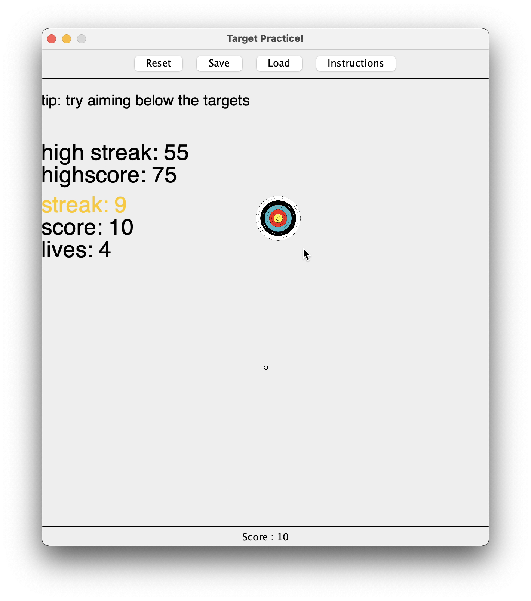

# Target Practice!
Made by Anthony Ge, originally made as a CIS 1200 final project.

## Instructions
`Left-Mouse` on the targets! Each target hit increase the score by one.
Click to get a high score and a high streak!

Certain targets also have different attributes:
* **Normal targets** are simply the regular looking targets lobbed in the sky.
* **Ghost targets** don't appear until they are near the maximum height of their trajectory.
* **Double targets** take two clicks to beat! After the first shot, they become faded and jump up a bit.
* **Fast targets** are faster and harder to hit than normal targets!

Save and load your game state by pressing the respective **Save/Load** buttons,
or also by using `S` and `L` keys.

## Video Demo (Click the Image!)

